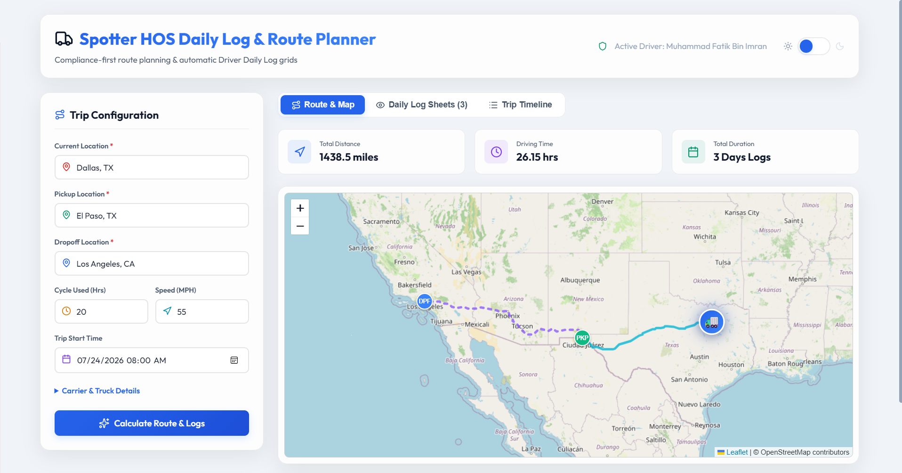
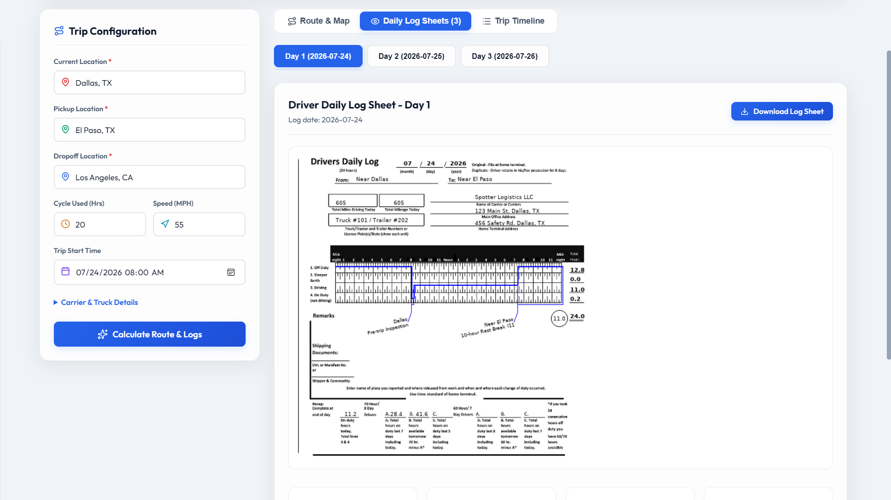
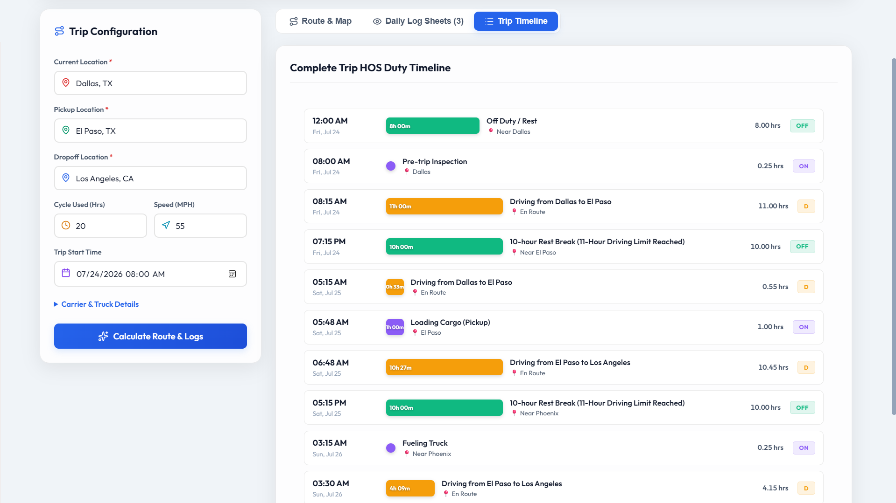

# Spotter Hours of Service (HOS) Daily Log & Route Planner

A full-stack compliance-first route planner and automatic Driver Daily Log sheet generator. Built using **Django** (backend) and **React** (frontend), this application takes current, pickup, and dropoff locations alongside the driver's HOS history, calculates an HOS-compliant route, and outputs both an interactive route map and custom-drawn paper log books using the official FMCSA 24-hour daily grid template.

---

## 📸 UI Screenshots

Below are placeholders for screenshots of the dashboard. Once you run the application, take screenshots, create a `screenshots/` directory, and save the images with these names:

### 1. Trip Configuration & Interactive Route Map

*Figure 1: Premium dark glassmorphic dashboard featuring Leaflet route visualization, start/pickup/dropoff pins, and summary stats.*

### 2. Driver's Daily Log Sheet (Auto-Drawn Paper Log Grid)

*Figure 2: The custom-drawn Driver's Daily Log Sheet (24 hours) with HOS grid lines, signature dates, totals, and remarks generated via Pillow.*

### 3. Detailed Trip HOS Duty Timeline

*Figure 3: Chronological vertical timeline showing every activity, rest break, fueling stop, and inspection required.*

---

## 🚀 Key Features

1. **HOS Compliance Simulator (FMCSA Part 395)**:
   - **11-Hour Driving Limit**: Drivers are automatically restricted to 11 hours of driving per window.
   - **14-Hour On-Duty Window**: Driving is prohibited after the 14th consecutive hour of coming on duty.
   - **30-Minute Rest Break**: A 30-minute off-duty break is scheduled before exceeding 8 cumulative hours of driving.
   - **70-Hour / 8-Day Cycle Limit**: Tracks accumulated on-duty time; automatically inserts a **34-hour restart** when the limit is exceeded.
   - **Fueling Stops**: Fueling (15 minutes, On-Duty Not Driving) is scheduled automatically at least once every 1,000 miles.
   - **Pickup / Dropoff Window**: Includes a mandatory 1-hour loading/unloading (On-Duty Not Driving) period at pickup and dropoff destinations.
   - **Inspections**: Schedules 15-minute pre-trip and post-trip inspections.
2. **Pillow Log Drawing Engine**:
   - Takes the HOS simulation results and draws clean, vector-aligned horizontal and vertical lines representing duty status on the `blank-paper-log.png` grid.
   - Fills out all administrative headers: date, carrier name, trailer numbers, addresses, total miles, and total hours per status.
   - Outputs a chronological recap table and status change remarks directly on the form.
3. **Interactive Dashboard**:
   - Built on a modern, dark-glassmorphism theme using the premium **Outfit** Google Font.
   - Integrates **Leaflet (OpenStreetMap)** to display routes, leg segments, and stop markers without requiring paid API keys.
   - Offers an in-app image viewer and direct PNG downloads for every daily log sheet.
   - Displays a vertical event timeline summarizing all driver activities.

---

## 🛠️ Tech Stack

- **Backend**: Python 3, Django, Pillow (Image Processing), Requests, Django CORS Headers.
- **Frontend**: Vite + React, Vanilla CSS, Lucide React (Icons), Leaflet.js (Mapping).

---

## 🏃 Run the Project Locally

### 1. Clone & Set Up Backend (Django)

1. Open a terminal in the `backend/` directory.
2. Install the python dependencies (if not already installed globally):
   ```bash
   pip install django django-cors-headers requests pillow
   ```
3. Run migrations and start the Django development server:
   ```bash
   python manage.py migrate
   python manage.py runserver
   ```
   The backend will start running on **`http://localhost:8000/`**.

### 2. Set Up Frontend (React)

1. Open a new terminal in the `frontend/` directory.
2. Install the node packages:
   ```bash
   npm install
   ```
3. Start the Vite React development server:
   ```bash
   npm run dev
   ```
   The frontend dashboard will start running on **`http://localhost:5173/`** (or `localhost:3000`).

---

